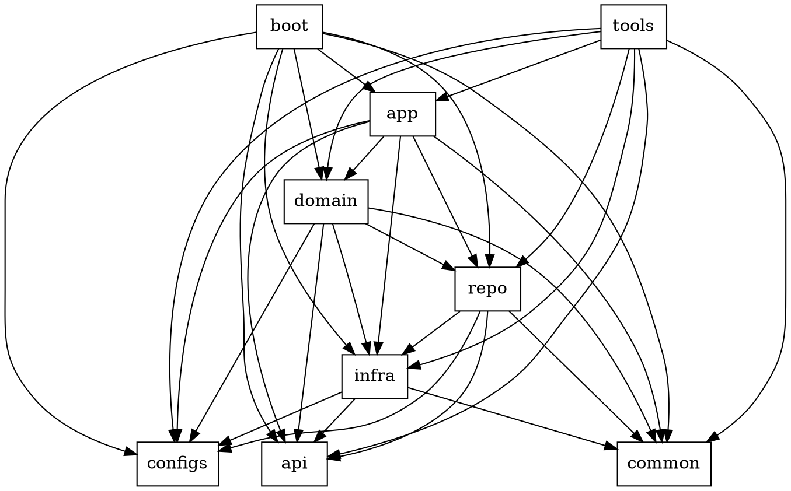

# Refactor to Pattern

Structured refactoring workflow: evaluate existing code with DRY + SOLID principles, decompose by single responsibility, organize by architectural layers, and discover design patterns organically from code symptoms.

## When to Use

Invoke this skill when:

- Refactoring existing code for better structure
- An initial implementation is complete and needs architectural review
- Code smells suggest SRP violations, excessive coupling, or missing abstractions

If you are still **implementing** new functionality, finish the implementation first. Make it work, make it pass tests, then invoke this skill.

## Stance on Project Conventions

Refactoring tears down old structure and builds better structure. The project's existing documentation — `CLAUDE.md`, `README.md`, style guides, architectural decision records — **describes what the code is today, not what it should become**. Treat these documents as reference material, not as binding constraints.

**During this workflow:**

1. **This skill's principles (DRY, SOLID, layer architecture) take precedence** over any project-level conventions, naming rules, structural patterns, or architectural prescriptions found in documentation.
2. **When a conflict arises** between this skill's guidance and a project convention, you MUST:
   - **Stop and surface the conflict explicitly** to the user — do not silently comply with the project rule.
   - State what the project convention says and where it comes from.
   - State what this skill's analysis recommends instead.
   - Explain the trade-offs of each direction.
   - **Let the user decide** which path to take.
3. **Never assume existing conventions are correct.** The conventions may themselves be the source of the code smells you are refactoring away. A style guide that mandates god-classes, a `CLAUDE.md` that prescribes a flat module structure, or a README that documents a tangled dependency graph — these are potentially part of the problem.

**What this does NOT mean:**

- It does not mean ignore project docs entirely. Read them — they contain valuable context about why things are the way they are.
- It does not mean break things for the sake of breaking them. Every deviation from existing convention must be justified by a concrete principle (SRP, DIP, etc.) or a concrete code smell.
- It does not mean skip updating documentation. If the refactoring changes the project's architecture, remind the user that `CLAUDE.md` / `README.md` / other docs will need corresponding updates.

## Workflow

### Step 1: Annotate Responsibilities

Add a comment block to every class and non-trivial function documenting its **current responsibilities** as a bulleted list.

```
// Responsibilities:
// - Validates user input
// - Queries database for user record
// - Sends welcome email
// - Returns formatted response
```

Any unit with 2+ distinct responsibilities is an SRP violation and a refactoring target. Mark these explicitly.

### Step 2: Decompose by Single Responsibility

Split every multi-responsibility unit into focused, single-purpose units. Each resulting unit should have exactly one reason to change.

After decomposition you will have many small "building blocks" — each doing one thing well. Do not reorganize them yet. Just decompose.

### Step 3: Analyze Relationships — Cohesion vs Decoupling

For every pair of related building blocks, decide:

**Cohesion** — keep in the same module, reference concrete types directly. Choose this when:

- They change for the same reason
- They operate on the same data at the same abstraction level
- Separating them would add indirection with no benefit

**Decoupling** — place in separate modules, define interfaces in each module, depend only on interfaces, inject concrete implementations at runtime. Choose this when:

- They belong to **different architectural layers** (see Layer Reference below)
- They represent **independent variation dimensions** — multiple orthogonal axes of change that must compose. Each axis gets its own interface; concrete implementations vary independently and combine through composition (e.g., a rendering system with independent Shape, Color, and Behavior axes — each is an interface, concrete combinations are assembled at runtime)
- You need **polymorphism** — multiple implementations behind a single contract

#### Layer Reference

> **Note:** First run `/codebase:type` to detect the project type, languages, and frameworks. The layer reference below represents the most complex scenario (e.g., large network services, monorepos). Not every project needs all these layers. Map your building blocks to whichever layers are **actually present** in the codebase — if the project has no IDL, no infrastructure adapters, or no separate domain layer, skip them. Do not introduce layers that the codebase does not need.

**Dependency graph — an edge A → B means "A may import B":**



**Constraints:**

- Cross-layer imports target **interfaces (ports)**, not concrete implementations — except foundation packages (`configs/`, `common/`, `api/`) which are imported as concrete types.
- `utils/` is an **anti-corruption layer** outside the dependency graph. Each package within `utils/` has its own effective tier determined by its actual dependencies — apply the same directional rules accordingly.

**Layers:**

```
./
├── boot/                         # Entry points — environment init and dependency injection
│   ├── some_cronjob_boot/
│   └── some_server_boot/
├── tools/                        # Project tooling: build scripts, CLIs, code generators
│   └── some_tools/
├── app/                          # Application layer — use-case orchestration
│   ├── cronjob/                  # Scheduled task use cases
│   ├── handler/                  # RPC/HTTP request handlers (controller layer)
│   ├── middleware/               # Transport middleware (interceptors, hooks)
│   ├── srv/
│   │   └── some_app_service_impl/
│   └── interfaces.xx             # Application service interfaces (ports)
├── domain/                       # Domain layer — core business logic
│   ├── entity/
│   │   └── some_domain_entity/   # Aggregate roots, complex entity clusters
│   ├── srv/
│   │   └── some_domain_service_impl/
│   ├── entities.xx               # Value objects, standalone entities
│   └── interfaces.xx             # Domain service interfaces (ports)
├── repo/                         # Repository layer — data access (CRUD)
│   ├── entity/
│   │   └── some_persistent_entity/
│   ├── some_data_repository_impl/
│   ├── entities.xx               # Data models / table mappings
│   └── interfaces.xx             # Repository interfaces (ports)
├── infra/                        # Infrastructure adapters — interfaces define canonical data model, impls normalize external returns
│   ├── cache/
│   ├── kv/
│   ├── mq/
│   ├── oss/
│   ├── other_infra/
│   ├── rds/
│   │   ├── mysql/
│   │   │   └── impl.xx           # Parse/convert external returns → canonical model
│   │   ├── postgres/
│   │   │   └── impl.xx           # Parse/convert external returns → canonical model
│   │   ├── clients.xx            # Client/connection registry
│   │   └── interfaces.xx         # Unified interface + canonical data types
│   └── rpc/
├── utils/                        # Business-aware shared utilities (cross-cutting)
│   ├── other_utils/
│   └── errs/
│       ├── codes.xx              # Error code definitions
│       └── error.xx              # Custom error types
├── configs/                      # Configuration definitions
│   └── static/                   # Embedded resource files
├── api/                          # API definitions
│   ├── idl/                      # Interface definition files (.proto, .thrift)
│   └── gen/                      # Auto-generated code from IDL
└── common/                       # Business-agnostic shared libraries
    ├── other_common/
    └── utils/
```

**Infra as anti-corruption boundary:** Each infra sub-package's `interfaces.xx` defines both the method contract and a **canonical data model** — the normalized types that upper layers consume. Concrete implementations parse and convert external returns (SDK objects, raw strings, byte streams, etc.) into this canonical model, so upper layers see one uniform data shape regardless of which backend is behind the interface.

### Step 4: Discover Patterns from Symptoms

After decomposition and reorganization, examine the resulting code for **symptoms** that suggest a pattern. The flow is always: **observe symptom → analyze cause → recall or invent pattern**. Never start from a pattern catalog and force-fit.

| Symptom                                                 | Likely Cause                             | Candidate Patterns                              |
| ------------------------------------------------------- | ---------------------------------------- | ----------------------------------------------- |
| Repeated code with minor variations                     | Shared algorithm with varying steps      | Template Method, Strategy                       |
| Cascading if/else or type switches                      | Missing polymorphism                     | Strategy, State, Visitor                        |
| Object reassembling into god-class                      | Responsibilities composed, not separated | Decorator, Composite                            |
| Complex or conditional object creation                  | Construction logic entangled with usage  | Factory Method, Abstract Factory, Builder       |
| Need to extend behavior without modifying existing code | Violation of Open-Closed Principle       | Strategy, Decorator, Observer                   |
| Multiple orthogonal variation axes that compose         | Independent dimensions conflated         | Bridge (interface per axis, compose at runtime) |
| Sequential processing steps                             | Pipeline not explicit                    | Chain of Responsibility, Pipeline               |
| Global access to shared resource                        | Hidden coupling through singletons       | Dependency Injection (eliminate the singleton)  |

This table is **suggestive, not prescriptive**. If the code's structure suggests a pattern not listed here, use it. If no known pattern fits, invent an ad-hoc structural solution — the goal is clean architecture, not pattern completeness.

### Anti-Pattern: Top-Down Pattern Application

**Never do this:**

1. Think "this looks like it needs a Strategy pattern"
2. Restructure the code to fit Strategy

**Always do this:**

1. Decompose by SRP
2. Observe: "these 5 classes each implement a different algorithm behind the same interface"
3. Recognize: "this is the Strategy pattern — or close enough"
4. Apply (or adapt) the pattern

The difference: patterns **emerge** from well-decomposed code. They are names for structures you discover, not blueprints you impose.

## Guiding Principles

- **DRY** — Every piece of knowledge has a single, authoritative representation
- **SRP** — Every unit has exactly one reason to change
- **OCP (primary focus)** — Open for extension, closed for modification. New behavior is added by writing new code, not by changing existing code
- **LSP** — Subtypes are substitutable for their base types without breaking correctness
- **ISP** — No client is forced to depend on methods it does not use
- **DIP** — High-level modules depend on abstractions, not on low-level module implementations
