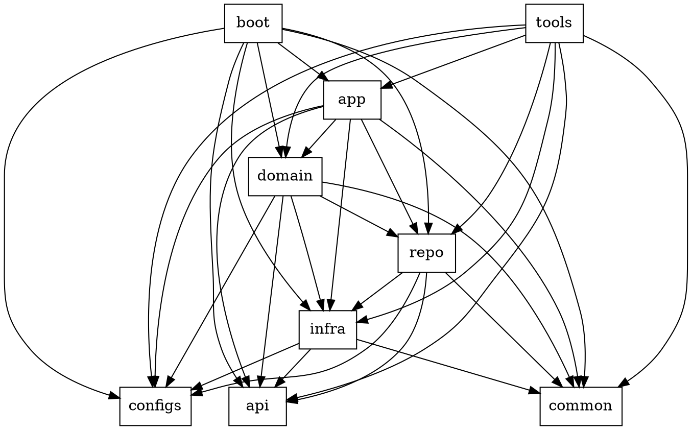

# Layer Reference

> **Note:** First invoke the skill: `$codebase:type` to detect the project type, languages, and frameworks. The layer reference below represents the most complex scenario (e.g., large network services, monorepos). Not every project needs all these layers. Map your building blocks to whichever layers are **actually present** in the codebase — if the project has no IDL, no infrastructure adapters, or no separate domain layer, skip them. Do not introduce layers that the codebase does not need.

**Dependency graph — an edge A → B means "A may import B":**



**Constraints:**

- Cross-layer imports target **interfaces (ports)**, not concrete implementations — except foundation packages (`configs/`, `common/`, `api/`) which are imported as concrete types.
- `utils/` is an **anti-corruption layer** outside the dependency graph. Each package within `utils/` has its own effective tier determined by its actual dependencies — apply the same directional rules accordingly.

**Layers:**

```
./
├── boot/                         # Entry points — environment init and dependency injection
│   ├── some_cronjob_boot/
│   └── some_server_boot/
├── tools/                        # Project tooling: build scripts, CLIs, code generators
│   └── some_tools/
├── app/                          # Application layer — use-case orchestration
│   ├── cronjob/                  # Scheduled task use cases
│   ├── handler/                  # RPC/HTTP request handlers (controller layer)
│   ├── middleware/               # Transport middleware (interceptors, hooks)
│   ├── srv/
│   │   └── some_app_service_impl/
│   └── interfaces.xx             # Application service interfaces (ports)
├── domain/                       # Domain layer — core business logic
│   ├── entity/
│   │   └── some_domain_entity/   # Aggregate roots, complex entity clusters
│   ├── srv/
│   │   └── some_domain_service_impl/
│   ├── entities.xx               # Value objects, standalone entities
│   └── interfaces.xx             # Domain service interfaces (ports)
├── repo/                         # Repository layer — data access (CRUD)
│   ├── entity/
│   │   └── some_persistent_entity/
│   ├── some_data_repository_impl/
│   ├── entities.xx               # Data models / table mappings
│   └── interfaces.xx             # Repository interfaces (ports)
├── infra/                        # Infrastructure adapters — interfaces define canonical data model, impls normalize external returns
│   ├── cache/
│   ├── kv/
│   ├── mq/
│   ├── oss/
│   ├── other_infra/
│   ├── rds/
│   │   ├── mysql/
│   │   │   └── impl.xx           # Parse/convert external returns → canonical model
│   │   ├── postgres/
│   │   │   └── impl.xx           # Parse/convert external returns → canonical model
│   │   ├── clients.xx            # Client/connection registry
│   │   └── interfaces.xx         # Unified interface + canonical data types
│   └── rpc/
├── utils/                        # Business-aware shared utilities (cross-cutting)
│   ├── other_utils/
│   └── errs/
│       ├── codes.xx              # Error code definitions
│       └── error.xx              # Custom error types
├── configs/                      # Configuration definitions
│   └── static/                   # Embedded resource files
├── api/                          # API definitions
│   ├── idl/                      # Interface definition files (.proto, .thrift)
│   └── gen/                      # Auto-generated code from IDL
└── common/                       # Business-agnostic shared libraries
    ├── other_common/
    └── utils/
```

**Infra as anti-corruption boundary:** Each infra sub-package's `interfaces.xx` defines both the method contract and a **canonical data model** — the normalized types that upper layers consume. Concrete implementations parse and convert external returns (SDK objects, raw strings, byte streams, etc.) into this canonical model, so upper layers see one uniform data shape regardless of which backend is behind the interface.
